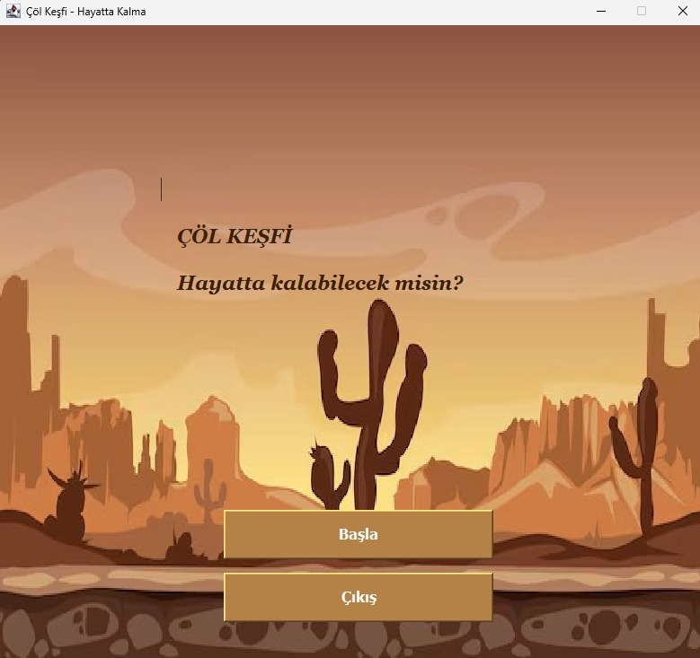
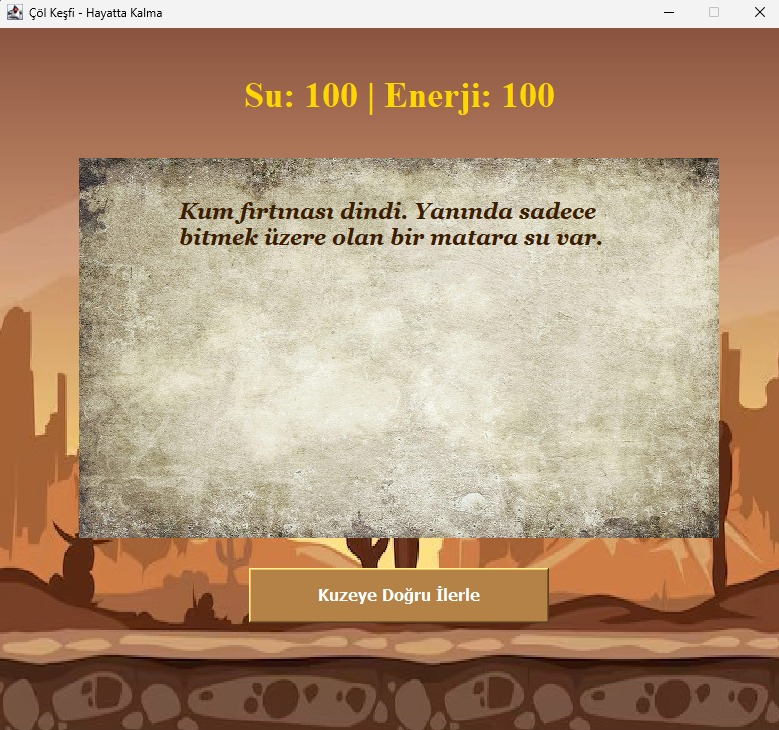
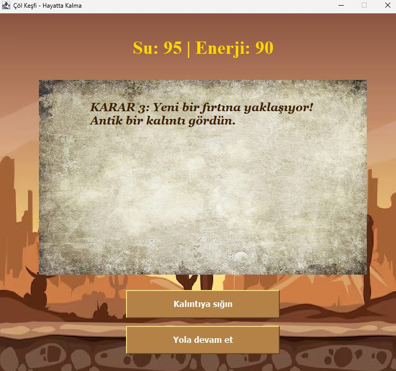
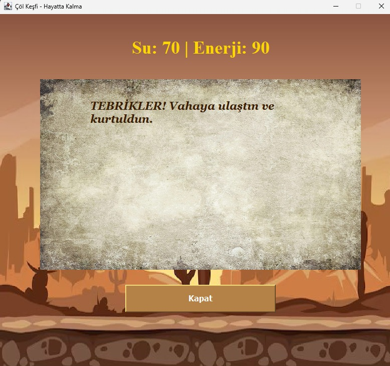

# 🏜️ Çöl Keşfi: Hayatta Kalma Oyunu

Bu proje, Java Swing kullanılarak geliştirilmiş, görsel odaklı bir **metin tabanlı hayatta kalma macerasıdır**. Oyuncu, sınırlı kaynaklarla uçsuz bucaksız bir çölde doğru kararları vererek kurtuluşa ermeye çalışır.

## 🎮 Oyunun Amacı
Kum fırtınasında kaybolan bir gezgin olarak, elindeki **Su** ve **Enerji** seviyelerini yöneterek 4 kritik karar aşamasını geçmeli ve vahaya ulaşmalısın. 

## ⚙️ Özellikler
* **Dinamik Kaynak Yönetimi:** Kararlarına göre değişen gerçek zamanlı Su ve Enerji takibi.
* **Görsel Arayüz:** Çöl temalı arka plan, parşömen metin alanı ve ahşap tabela tasarımları.
* **Çoklu Sahne:** Ana menü, başlangıç, 4 farklı karar anı ve farklı oyun sonu ekranları.
* **Eski Çağ Atmosferi:** Temaya uygun yazı tipleri (Georgia Bold Italic) ve renk paleti.

## 🛠️ Teknik Bilgiler
* **Dil:** Java
* **Kütüphane:** Java Swing & AWT
* **Yapı:** JFrame üzerine özelleştirilmiş `paintComponent` çizimleri ve mutlak konumlandırma (Absolute Layout).

## 🚀 Nasıl Çalıştırılır?
1. Projeyi bilgisayarınıza indirin.
2. `src/res` klasöründe gerekli görsellerin (`col_arkaplan.jpg`, `parsonem.jpg`) olduğundan emin olun.
3. `ColKesfiOyunu.java` dosyasını favori IDE'nizde (Eclipse, IntelliJ vb.) çalıştırın.

<h2 align="center">Oyun Ekran Görüntüleri</h2>

<table align="center">
  <tr>
    <td align="center">
       
      <b>Ana Menü</b>
    </td>
    <td align="center">
       
      <b>Oyun Başlangıcı</b>
    </td>
  </tr>
  <tr>
    <td align="center">
       
      <b>Karar Ekranı</b>
    </td>
    <td align="center">
       
      <b>Final Ekranı</b>
    </td>
  </tr>
</table>
---
*Bu proje bir eğitim ödevi kapsamında geliştirilmiştir.*